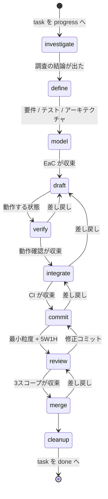
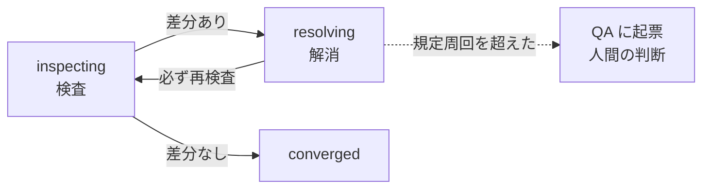

# 開発ワークフロー (EaC)

`development-workflow.allium` が、ブランチ運用ルール ([../standard.json](../standard.json)) に
したがって task 1件を着手から完了まで運ぶ工程を定義する。
Allium spec なので**機械的に検証できる**のがこの形式にしている理由。

```sh
allium check   repos/common/workflow/development-workflow.allium   # 構文と構造
allium analyse repos/common/workflow/development-workflow.allium   # データフロー・到達性・競合
allium plan    repos/common/workflow/development-workflow.allium   # テスト義務の導出
```

## 工程



| stage | やること | 成果物 |
| --- | --- | --- |
| `investigate` | 調査 | 調査記録 (`daily/<日付>/agents/<ツール>/<セッションID>/`) |
| `define` | 要件定義 / テスト定義 / システムアーキテクチャの更新 | `SpecArtefact` (requirement / test_definition / architecture) |
| `model` | EaC の構築 | Allium spec / likeC4 モデル |
| `draft` | スクラッチパッド上で task を満たす動作する状態を作る | 動く実装 (未コミット) |
| `verify` | 動作確認 | 確認結果 (findings) |
| `integrate` | CI を回す | CI の結果 (findings) |
| `commit` | 動作可能最小限の粒度でコミット、5W1H で記述 | `Commit` (`builds_alone` / `message_has_5w1h`) |
| `review` | コミット / ブランチ / リポジトリの3スコープでレビュー | 修正コミット + ドキュメント |
| `merge` | `merge_target` に従ってマージ | PR |
| `cleanup` | worktree 削除・ブランチ削除・task を done へ・MEMORY.md 更新 | — |

## 収束ループ — 6つのスコープで同じ形を使う

動作確認・CI・3段のレビューは、いずれも
**「検査する → 見つけた差分を解消する → 再検査する」** という同じループである。
spec ではこれを `ConvergenceCycle` 1つで表し、`scope` を変えて再利用している。
工程ごとに別々の手順を定義しない。



| scope | 検査の手段 | 差分の閉じ方 |
| --- | --- | --- |
| `specification` | `allium check` / `analyse`、`likec4` | spec の修正 |
| `behaviour` | 動作確認 (`.worktrees/verify`) | 実装の修正 |
| `integration` | CI、E2E (`.worktrees/e2e`)、`allium weed` | 実装の修正 |
| `commit` | コミット単体のレビュー | 修正コミット |
| `branch` | ブランチ全体のレビュー | 修正コミット |
| `repository` | リポジトリ全体のレビュー | ドキュメント化 + task 起票 |

1つのループにまとめた効果として、以下が全スコープに一律で効く。

* **差分を解消したら必ず再検査する** (`ResolutionTriggersReinspection`) — 1周で終わったと見なさない
* **規定周回数で収束しなければエスカレーションする** (`UnconvergedCycleEscalates`) —
  収束しないものは構造的な問題である可能性が高いので、推測で進めず `qa/list/` に起票する
* **blocker / defect は必ず閉じ、improvement / note は task 起票して先に進める**
  (`ConvergenceCycle.blocking_findings`)

`repository` スコープだけは差分の閉じ方が違う (修正コミットではなくドキュメント化)。
このブランチのスコープを超える問題を抱え込まないためで、`RepositoryFindingsAreDocumented`
がその区別を持っている。

## ツールの役割

| ツール | 役割 | 状態 |
| --- | --- | --- |
| Allium | 振る舞いの仕様。spec → テスト義務 → 実装 を収束させる | 導入済み |
| likeC4 | システム構成 (C4 モデル) の定義 | CLI 導入済み |
| Superpowers | TDD・体系的デバッグ・完了前検証などの進め方 | **未導入** |

Superpowers はまだインストールされていない。spec 上は担い手 (`Operator`) の振る舞いとして
抽象化してあるので、導入後にどのスキルをどの工程へ割り当てるかを決めれば足りる。
割り当ての判断は spec 末尾の `open question` に残してある。

## 元の工程案から追加したもの

抜けていた要素を工程に組み込んである。

| 追加 | 理由 |
| --- | --- |
| `investigate` (調査) | このリポジトリの運用では task は必ず調査を伴う。要件定義はその結論を前提にする |
| QA へのエスカレーション | 曖昧さを推測で埋めないため。Allium の `open question` と同じ扱い |
| `merge` (PR 作成) | `branch-rule.json` に `merge_target` があるのに、工程にマージが無かった |
| `cleanup` (後片付け) | worktree・ローカルブランチ・task の状態・MEMORY.md が置き去りになる |
| コミット単体のビルド検証 | 「動作可能最小限」を担保するため (`git rebase --exec` 等) |
| `allium weed` を CI に含める | EaC を作る以上、spec と実装の乖離検出は継続的に回す必要がある |
| findings の重大度と `deferred` | 改善提案を task 起票して先に進める道を残すため |

未決のものは spec の `open question` に置いてある (パフォーマンス検証と観測性の扱い)。

## リポジトリごとに差し替える

`repos/<リポジトリ名>/workflow.allium` がこのファイルへの相対シンボリックリンクになっている。
独自の工程が必要なリポジトリは、リンクを実体ファイルに置き換えて編集する
(`branch-rule.json` と同じ方式)。

```sh
cp repos/common/workflow/development-workflow.allium repos/<リポジトリ名>/workflow.allium
```
